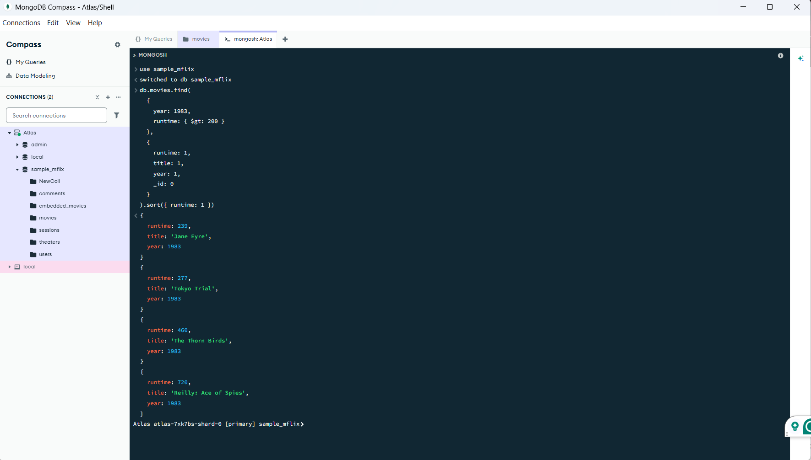
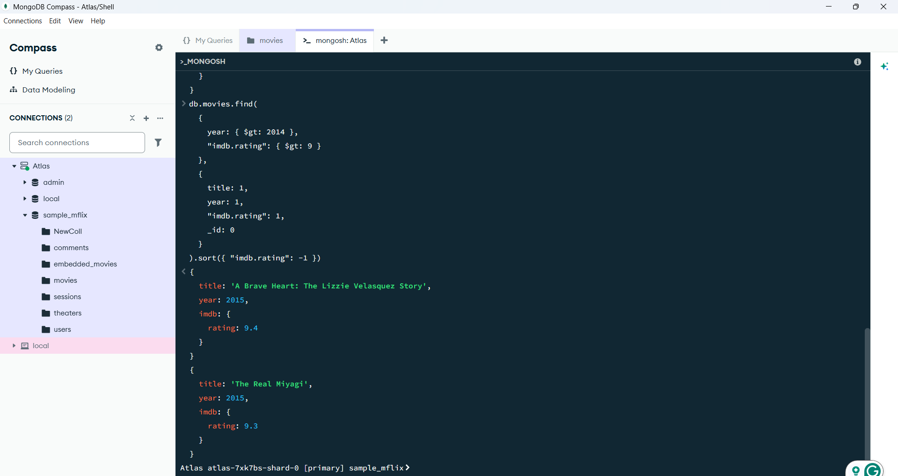

 # Assignment 3: MongoDB Setup and Queries
This assignment was done to further my understanding of 
MongoDB, MongoDB Compass, and running queries. 

## Prerequisites and Usage
No packages need to be installed to run this program. These queries were run fully on the MongoDB shell through MongoDB Compass. 

## Query 1

Query 1 asked us to "(1) Find all movies with runtime greater than 200 minutes in year 1983. The result should include a list of objects sorted by runtime increasing, and each object only has three fields: runtime, title, year."

db.movies.find(
  { 
    year: 1983, 
    runtime: { $gt: 200 } 
  }, 
  { 
    runtime: 1, 
    title: 1, 
    year: 1,
  }
).sort({ runtime: 1 })

I wrote the query by first specifying the query parameters by setting the year to be 1983 and the runtime to be greater than 200 minutes. This required adding extra {} with $gt. Then, I added in the three fields that each object must have. Specifically, I added the _id:0 to remove the id in the query result of each object. Lastly, I used .sort() to order the query results in increasing runtime length. The code snippet and output are shown below.

## Query 2

Query 2 asked us to "(2) Find all movies after year 2014 with imdb rating greater than 9."

db.movies.find(
  { 
    year: { $gt: 2014 }, 
    "imdb.rating": { $gt: 9 } 
  }, 
  { 
    title: 1, 
    year: 1, 
    "imdb.rating": 1, 
  }
).sort({ "imdb.rating": -1 })

I wrote the query by first specifying the year to be greater than 2014 and the imdb rating to be greater than 9. This required dot notation for imdb rating since the rating was nested inside imdb. Then, I added in the three fields that each object must have and again removed the id from the returned result. Lastly, I used .sort() to order the query results in decreasing rating. The code snippet and output are shown below.

